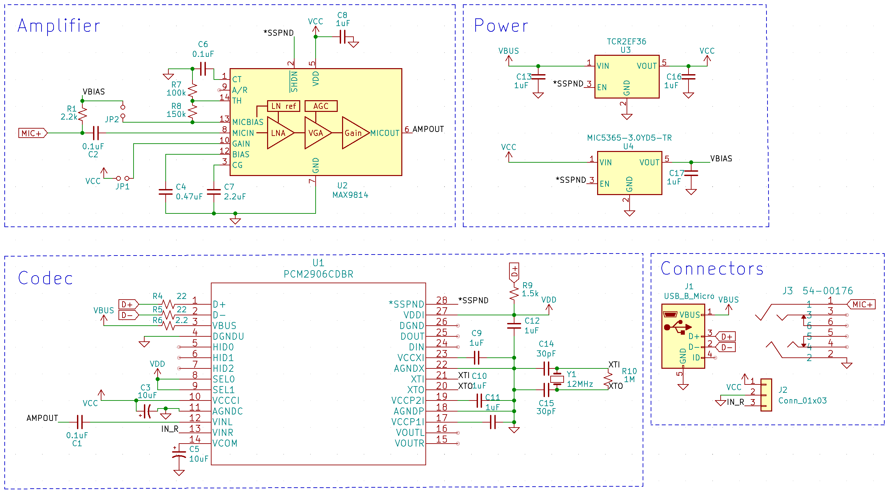

# USB Microphone (KiCad Project)

This repository contains the schematic for a USB-powered microphone module designed in KiCad. The circuit is based on the MAX9814 microphone amplifier and PCM2906 USB audio codec.



## Overview

The circuit is divided into several functional blocks:

### 🎙️ Amplifier
- **MAX9814** is used to amplify the microphone signal with Automatic Gain Control (AGC).
- External capacitors and resistors configure the gain, filtering, and biasing.

### 🔊 Codec
- **PCM2906CDBR** acts as the USB audio codec to interface the analog microphone signal to a USB digital signal.
- Connected to a USB interface with proper filtering and oscillator.

### ⚡ Power
- Two voltage regulators: **TCR2EF36** and **MIC5365** generate the required voltages (3.6V and bias voltage).
- USB VBUS is used as the main power source.

### 🔌 Connectors
- USB Micro-B connector for power and data.
- Microphone input and optional line-out header.

## Features

- Plug-and-play USB microphone
- On-board low-noise microphone preamp
- USB audio class compliant (via PCM2906)
- Bias and power filtering built in
- Compact and easy to integrate

## Tools Used

- [KiCad](https://kicad.org/) — open-source PCB design tool

## Getting Started

To view or modify the schematic:

1. Clone the repository:
   ```bash
   git clone https://github.com/VladyslavKukharchuk/usb-microphone.git
   cd usb-microphone-circuit
